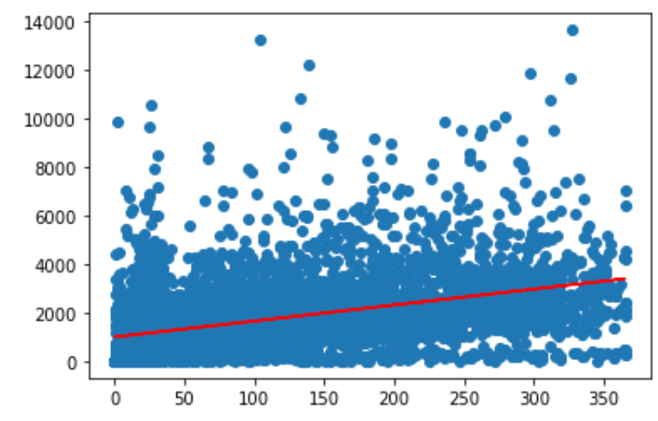

# Machine-Learning

## Overview

In order to determine the success or failure of Airbnb properties we will be using a Linear Model. Based on our cleaned dataset we will examine the number of nights booked and it's overall effect on revenue generated by the property. It is expected that there will be a clear correlation between these two measures.

## First Round of Machine Learning

Our initial linear model was achieved using the following code and rendered a scatter plot that indicates the rate at which nights booked can generate revenue. Below is a scatter plot with a line presenting the overall projected path.
 

[SimpleRegression2.ipynb](./SimpleRegression2.ipynb)
 

## Second Round of Machine Learning

In our second round of Machine Learning we are using a neural network. The model that we built has started off inconclusive, but with additional optimization should yield some useable results to answer our questions. So far, the preprocessing steps taken have been to remove all low information columns and use one hot encoder to handle categorical data.

[Final_ML](./Final_ML.ipynb)
 

## Third Round of Machine Learning

In our third and final round of Machine Learning